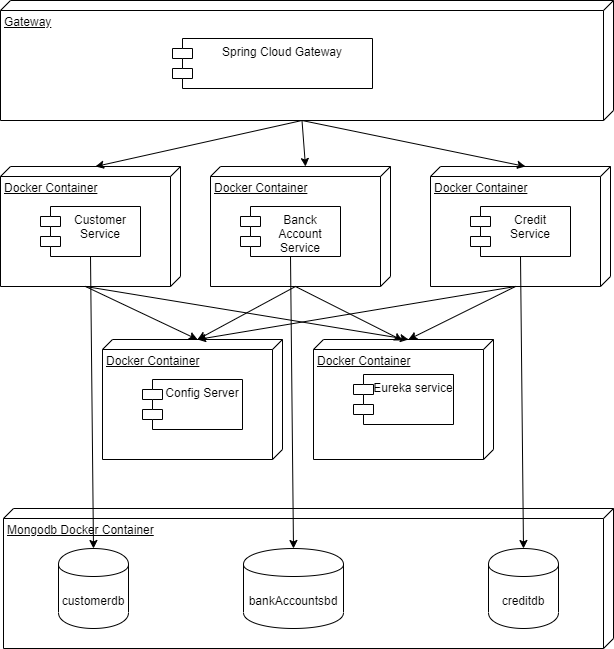

# project4 updated - credit

### Command for run Dockerfile and start container
cd /credits

docker build -t "credits"

docker run --restart always --name credtis -8080:9000 -d credtis:latest

### Docker Compose
cd /credits

docker-compose up -d

### Sonarqube

docker run -d --name sonarqube -p 8090:9000 sonarqube

## Arquitectura de Microservicio
